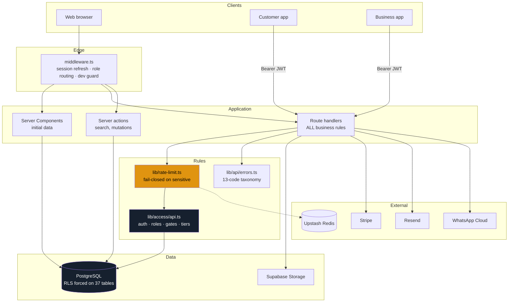
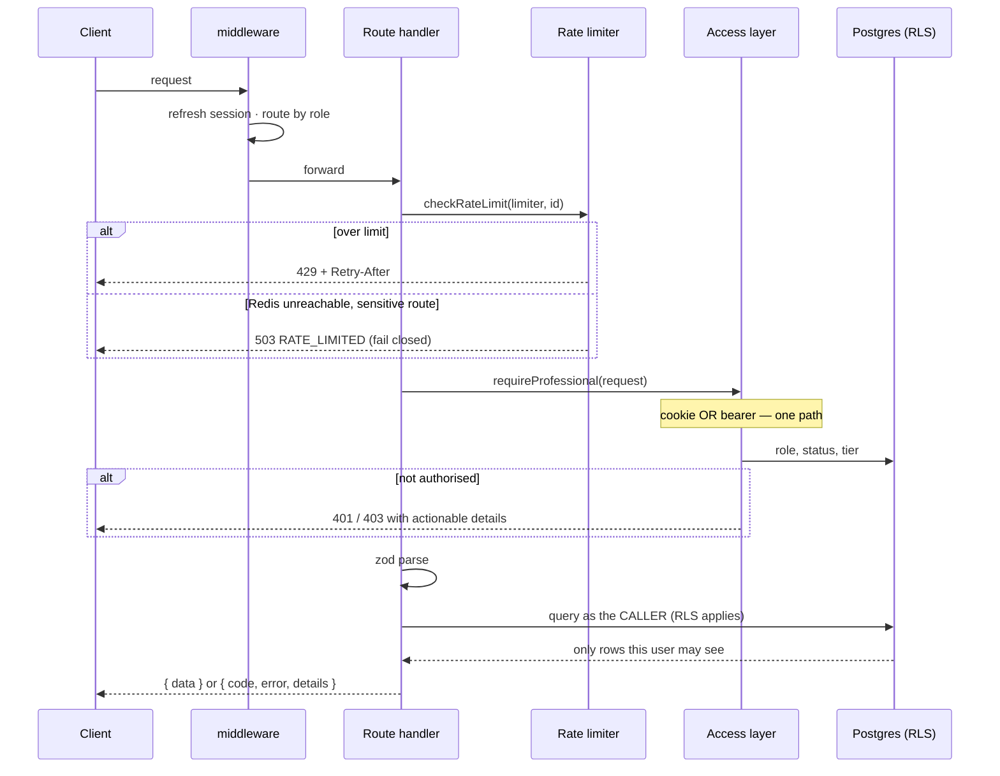
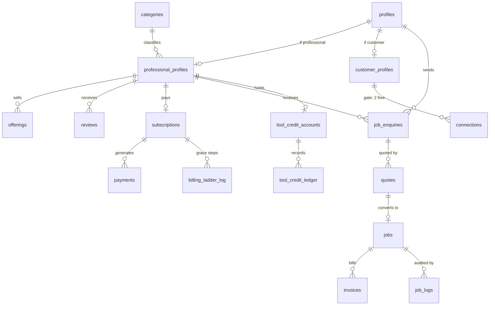
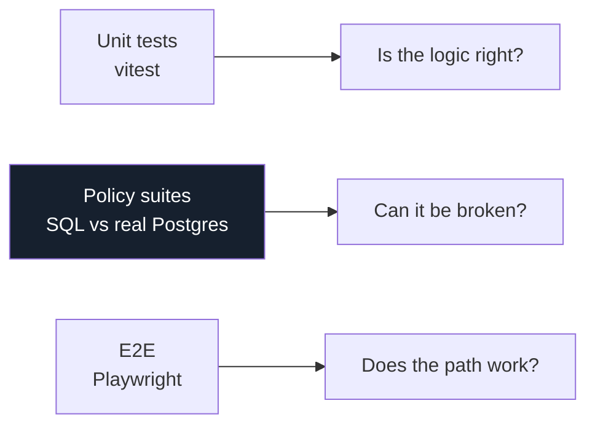

# TradeLynq V2 — Web Platform

Professional-services marketplace for Trinidad & Tobago. **Customers** browse and engage free; **Professionals** subscribe for visibility and operating tools. Trust is the product — ranking is earned, never bought.

This is the ground-up V2 rebuild. V1 lives at `../Tradelynq` and is **reference only: read it, never modify it.**

---

## Table of contents

1. [Start here in 5 minutes](#1-start-here-in-5-minutes)
2. [How the system fits together](#2-how-the-system-fits-together)
3. [The directive framework](#3-the-directive-framework) — the rules everything obeys
4. [Request lifecycle](#4-request-lifecycle)
5. [Data model map](#5-data-model-map)
6. [Tutorials](#6-tutorials)
7. [Testing](#7-testing)
8. [Command reference](#8-command-reference)
9. [Troubleshooting](#9-troubleshooting)

---

## 1. Start here in 5 minutes

### Prerequisites

| Tool | Why |
|---|---|
| Node 22+ | The runtime |
| Docker Desktop | Runs local Postgres, Auth, and Storage |
| Git | Version control |

### First run

```bash
npm install                 # 1. dependencies
cp .env.example .env.local   # 2. env surface — fill in what you have
npx supabase start           # 3. local Postgres + Auth (first run pulls images, ~5 min)
npm run db:reset             # 4. apply all migrations + seed
npm run dev                  # 5. http://localhost:3000
```

Then open **http://localhost:3000/dev/kit** — every UI primitive in both themes. If that renders, your setup is correct.

### Verify everything works

```bash
npm run verify   # typecheck + lint + lexicon + format + unit tests + policy tests
```

All six gates must pass. They also run in CI on every pull request.

> **You do not need real credentials to develop.** Local Supabase supplies its own. Stripe, Resend, Sentry, and PostHog all no-op without keys — features degrade, nothing crashes.

---

## 2. How the system fits together



**The single most important arrow** is mobile → API. In V1 the apps talked to the database directly and therefore bypassed every business rule: the connection gate, tier gates, and caps did not exist for mobile users. In V2 **all writes go through the API**, and `lib/access/api.ts` accepts both cookies and bearer tokens so there is exactly one rules layer.

---

## 3. The directive framework

These are not style preferences. Each rule exists because breaking it caused a real problem, and each is mechanically enforced.

### 3.1 Language

| Rule | Enforced by |
|---|---|
| People are **Customers** and **Professionals** — never "gig workers", "service providers", "tradespeople", "contractors" | `npm run lint:lexicon` |
| Commonwealth English: colour, organisation, enquiry, recognise | `lint:lexicon` |
| Money renders `TTD $X,XXX` via `formatTTD()` — never bare, never USD | `lint:lexicon` + unit tests |
| No emoji in UI | `lint:lexicon` |

> **Why the currency rule is absolute:** Trinidad & Tobago shares the dollar sign with the US. An unlabelled "$2,100" reads as roughly *seven times* its real price to anyone assuming USD.

### 3.2 Backend law

**Every route follows this order. No exceptions.**

```ts
export async function POST(request: Request) {
  // 1. RATE LIMIT — before anything expensive, before auth
  const limit = await checkRateLimit('enquiry', identifierFrom(request))
  if (!limit.ok) return limit.response

  // 2. AUTH / ROLE — proves who, and that they may be here
  const access = await requireCustomer(request)
  if (!access.ok) return access.response

  // 3. LEGAL GATE — outstanding documents block gated actions
  const legal = await ensureLegalAcceptances(access, ['terms_of_service'])
  if (!legal.ok) return legal.response

  // 4. ZOD — never trust a payload
  const parsed = schema.safeParse(await request.json())
  if (!parsed.success) return err('INVALID_INPUT', parsed.error.flatten())

  // 5. RLS-SCOPED QUERY — access.supabase, never the admin client
  const { data, error } = await access.supabase.from('job_enquiries').insert(...)
  if (error) return err('INTERNAL')          // never leak the DB error

  return ok(data)
}
```

Rate limiting comes **first** because an unauthenticated flood should be rejected before it costs a database round trip.

### 3.3 Database law — the seven rules

Every migration, without exception:

1. `ENABLE ROW LEVEL SECURITY` **and** `FORCE ROW LEVEL SECURITY`
2. Explicit `GRANT`s matching the policies — *RLS narrows access; it does not grant it*
3. Policies for every access path
4. An index on every foreign key (leading column)
5. `update_updated_at_column` trigger wherever `updated_at` exists
6. `SET search_path = ''` on every `SECURITY DEFINER` function
7. `types/database.ts` regenerated in the same commit

**All seven are checked automatically** by `tests/sql/aaa_schema_invariants.sql` against *every* table — including tables added by someone who never read this list.

### 3.4 Design law

Read [`DESIGN.md`](./DESIGN.md) before any visual decision. In short: semantic tokens only (never literal hex), motion from the closed M1–M16 catalogue in `lib/motion.ts`, loading/empty/error states on every data surface, mobile-first at 375px, both themes first-class.

### 3.5 Evidence before claims

Nothing is "done" without fresh command output. A migration that applies cleanly proves nothing about whether its RLS works — **write the test that tries to break it.** Three real defects in this codebase were found exactly that way and would have shipped otherwise.

---

## 4. Request lifecycle



### Error taxonomy

Every failure returns `{ code, error, details? }` from `lib/api/errors.ts`. **UI copy keys off `code`**, never the message — so the same gate reads identically on web, iOS, and Android, and can be translated without touching the server.

Each code's `details` shape is **typed**, so the compiler refuses an error that omits what the client needs to render the fix:

```ts
err('LEGAL_ACCEPTANCE_REQUIRED', { missingDocuments: ['terms_of_service'] })  // ✓
err('LEGAL_ACCEPTANCE_REQUIRED')                                              // ✗ compile error
err('INTERNAL')                                                               // ✓ opaque by design
```

---

## 5. Data model map



**37 tables.** The one structural change worth knowing: V1's `worker_profiles` and `business_profiles` are **one** `professional_profiles` table in V2. `business_profiles` was a strict subset of `worker_profiles`, and the split was the platform's single largest source of duplicated logic. What distinguishes a registered business is `profiles.professional_subtype`.

### The three Supabase clients

| Client | Use in | RLS |
|---|---|---|
| `lib/supabase/client.ts` | Client components | **Enforced** |
| `lib/supabase/server.ts` | RSC, routes, actions | **Enforced** |
| `lib/supabase/admin.ts` | Cron, webhooks, admin | **BYPASSED** |

`admin.ts` imports `server-only`, so importing it from a client component is a **build error**, not a runtime surprise. It grants unrestricted read/write over every table; shipping it to a browser would be the worst security failure available to this codebase.

---

## 6. Tutorials

### 6.1 Add an API route

```bash
mkdir -p app/api/enquiries/create
```

```ts
// app/api/enquiries/create/route.ts
import { z } from 'zod'
import { checkRateLimit, identifierFrom } from '@/lib/rate-limit'
import { requireCustomer, ensureLegalAcceptances } from '@/lib/access/api'
import { err, ok } from '@/lib/api/errors'

const schema = z.object({
  professionalId: z.string().uuid(),
  description: z.string().min(20).max(1000),   // D54 — canonical limits
})

export async function POST(request: Request) {
  const limit = await checkRateLimit('enquiry', identifierFrom(request))
  if (!limit.ok) return limit.response

  const access = await requireCustomer(request)
  if (!access.ok) return access.response

  const legal = await ensureLegalAcceptances(access, ['terms_of_service'])
  if (!legal.ok) return legal.response

  const parsed = schema.safeParse(await request.json())
  if (!parsed.success) return err('INVALID_INPUT', parsed.error.flatten())

  const { data, error } = await access.supabase
    .from('job_enquiries')
    .insert({ professional_id: parsed.data.professionalId, description: parsed.data.description })
    .select()
    .single()

  if (error) return err('INTERNAL')   // log detail, never return it
  return ok(data)
}
```

**Checklist:** limiter chosen from `LIMITERS` · guard matches the audience · zod on every input · `access.supabase` not the admin client · errors from the taxonomy · no raw DB error returned.

### 6.2 Add a database table

```bash
npx supabase migration new add_widgets
```

```sql
CREATE TABLE public.widgets (
  id UUID PRIMARY KEY DEFAULT gen_random_uuid(),
  professional_id UUID NOT NULL
    REFERENCES public.professional_profiles(id) ON DELETE CASCADE,
  name TEXT NOT NULL,
  created_at TIMESTAMPTZ NOT NULL DEFAULT NOW(),
  updated_at TIMESTAMPTZ NOT NULL DEFAULT NOW()
);

CREATE INDEX widgets_professional_idx ON public.widgets (professional_id);   -- rule 4

CREATE TRIGGER widgets_updated_at                                            -- rule 5
  BEFORE UPDATE ON public.widgets
  FOR EACH ROW EXECUTE FUNCTION update_updated_at_column();

ALTER TABLE public.widgets ENABLE ROW LEVEL SECURITY;                        -- rule 1
ALTER TABLE public.widgets FORCE ROW LEVEL SECURITY;

GRANT SELECT, INSERT, UPDATE ON public.widgets TO authenticated;             -- rule 2

CREATE POLICY widgets_own ON public.widgets                                  -- rule 3
  FOR ALL TO authenticated
  USING (public.owns_professional_profile(professional_id))
  WITH CHECK (public.owns_professional_profile(professional_id));
```

```bash
npm run db:reset                                          # apply
npm run test:policies                                     # invariants check all 7 rules
npx supabase gen types typescript --local > types/database.ts   # rule 7
```

**Then write the policy test.** Applying cleanly proves nothing about whether the RLS works — see §7.2.

### 6.3 Add a UI component

```tsx
import { cn } from '@/lib/utils/cn'
import { motion } from '@/lib/motion'

export function Thing({ className }: { className?: string }) {
  return (
    <div className={cn('rounded-[--radius-card] bg-card text-body', motion('hoverRaise'), className)}>
      <p className="font-mono tabular-nums">{formatTTD(2100)}</p>
    </div>
  )
}
```

**Never** `bg-white`, `text-slate-700`, `#F7F7F5`, or `transition-all` — CI rejects all four. Add it to `/dev/kit` so it is reviewable in both themes.

### 6.4 Gate a feature by tier

```ts
const access = await requireProfessional(request)
if (!access.ok) return access.response

const gated = requireTierFeature(access, 'crm')
if (!gated.ok) return gated.response   // 403 naming the CHEAPEST sufficient tier
```

---

## 7. Testing

Three layers, each answering a different question.



### 7.1 Unit — `npm test`

Pure logic: formatting, pricing, the error taxonomy, the rate-limit matrix.

### 7.2 Policy suites — `npm run test:policies`

**The layer that matters most.** SQL run against real Postgres, asserting security properties by *exercising* them.

| Suite | Covers |
|---|---|
| `aaa_schema_invariants` | All 7 database rules, every table, automatically |
| `profiles_policy` | Signup trigger, privilege guards |
| `profiles_domain_policy` | Categories, professional and customer profiles |
| `marketplace_policy` | Enquiries, offerings, bookings, reviews, disputes |
| `commerce_policy` | Subscriptions, invoices, credits, **concurrency** |
| `zzz_guard_bypass_attack` | Adversarial attacks on the guard bypass |

**Three traps that have each bitten this project.** Avoid all three when writing a suite:

1. **A missing GRANT raises `permission denied for table` — SQLSTATE 42501 — the *same* `insufficient_privilege` your guards raise deliberately.** A test that only catches the code passes while proving nothing. Always also assert `msg NOT LIKE '%permission denied for table%'` and check the expected message text.
2. **Guards use `IS DISTINCT FROM`**, so writing a column back to its current value is a no-op and correctly does not raise. Test values must genuinely differ.
3. **`SET LOCAL request.jwt.claims` persists across `SET LOCAL ROLE`.** To act as the service role you must also `SET LOCAL request.jwt.claims TO '{}'`.

**Prove your test can fail.** Break the thing it guards, confirm the suite goes red, then restore. A test that cannot fail is decoration.

---

## 8. Command reference

| Command | Does |
|---|---|
| `npm run dev` | Dev server |
| `npm run verify` | **All six gates** — run before every commit |
| `npm run typecheck` | `tsc --noEmit` |
| `npm run lint` | ESLint |
| `npm run lint:lexicon` | Canon enforcement (vocabulary, currency, design) |
| `npm run format` | Prettier write |
| `npm test` | Unit tests |
| `npm run test:policies` | SQL policy suites (needs Docker) |
| `npm run build` | Production build |
| `npm run db:reset` | Reapply all migrations |
| `npx supabase start` / `stop` | Local stack |

---

## 9. Troubleshooting

| Symptom | Cause and fix |
|---|---|
| `No running supabase_db_* container` | `npx supabase start` |
| `permission denied for table X` | Missing `GRANT`. RLS narrows access; it does not grant it. |
| Policy applies but returns no rows | RLS is denying. Check the policy's `USING` matches `auth.uid()`. |
| `You're importing a module that depends on "server-only"` | A client component imported `lib/supabase/admin.ts`. Correct — use `server.ts`. |
| Lexicon lint fails on a comment | Comments are exempt from design/currency rules. If it is a real match, opt out with `// lexicon-ok: <reason>` — the reason is mandatory. |
| Build fails: "Production build refused" | `VERCEL_ENV=production` without secrets. Expected — the guard is working. |
| `Invalid package config … Unexpected token ''` | A UTF-8 BOM in a JSON file, usually from PowerShell `-Encoding utf8`. Rewrite without BOM. |

---

## Where the specifications live

| Question | Source |
|---|---|
| What am I building next? | `../Tradelynq/docs/REBUILD-PLAYBOOK.md` — the S-numbered queue and its own tracker |
| What does this surface do? | `../TradeLynq-Docs/v2/` chapters 01–17 |
| Exact strings, contracts, props | `../TradeLynq-Docs/v2/details/` |
| Why was this decided? | `../TradeLynq-Docs/v2/12-DECISIONS-AND-OPEN-QUESTIONS.md` — never contradict a D-number |
| What changed vs V1? | [`V1-DELTA.md`](./V1-DELTA.md) |

**Precedence:** code beats docs on what *exists*; docs beat code on what V2 *builds*; detail file > chapter > book. A contradiction between spec and V1 is a **flag, not a judgement call** — log it, never silently resolve it.
