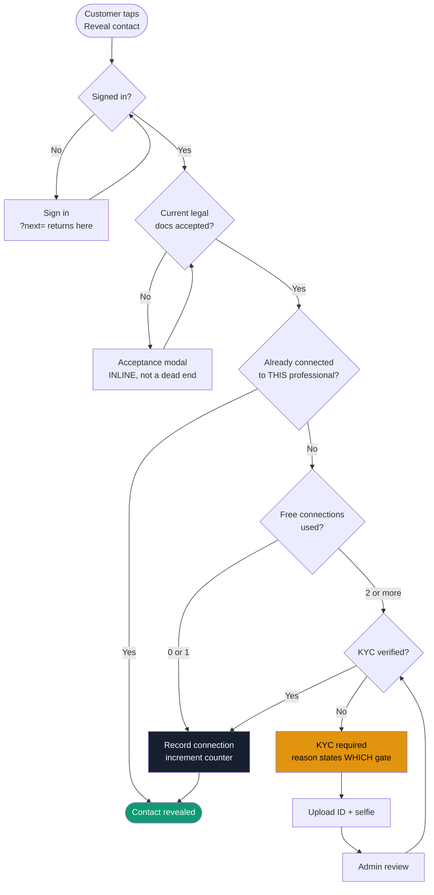
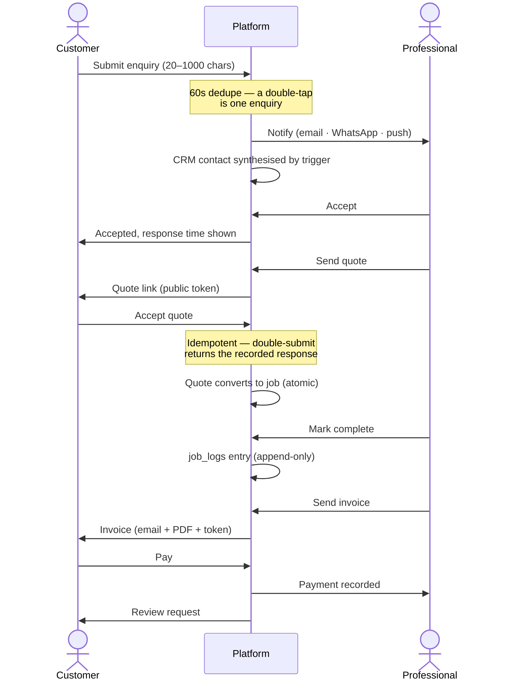
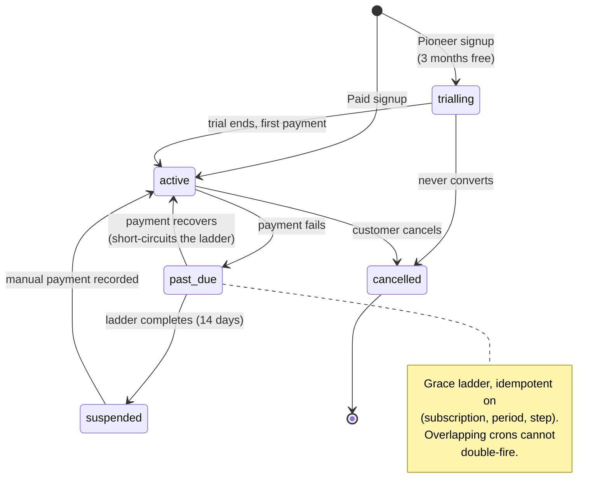
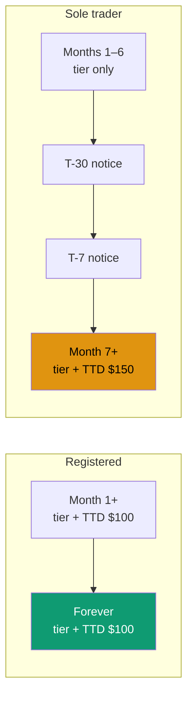
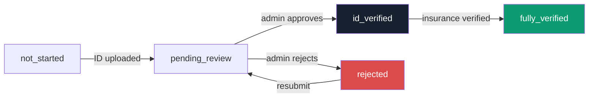
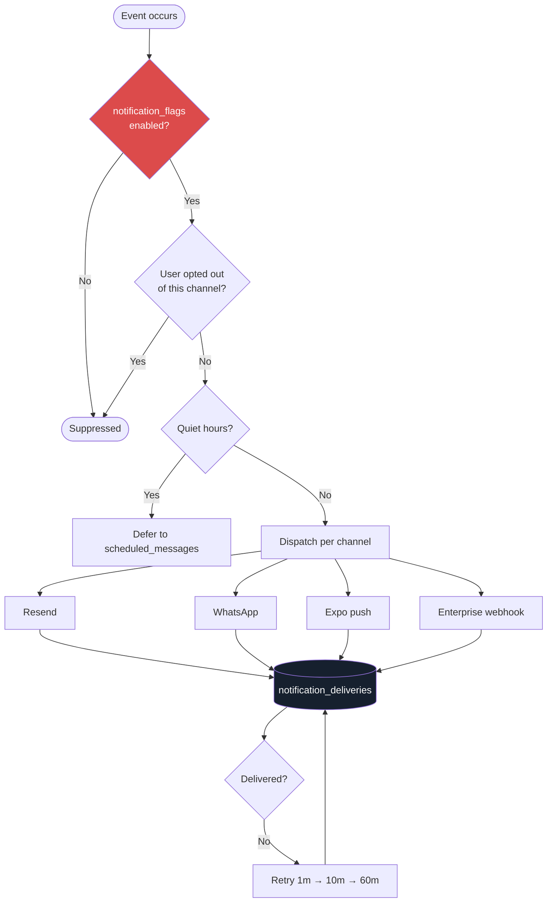
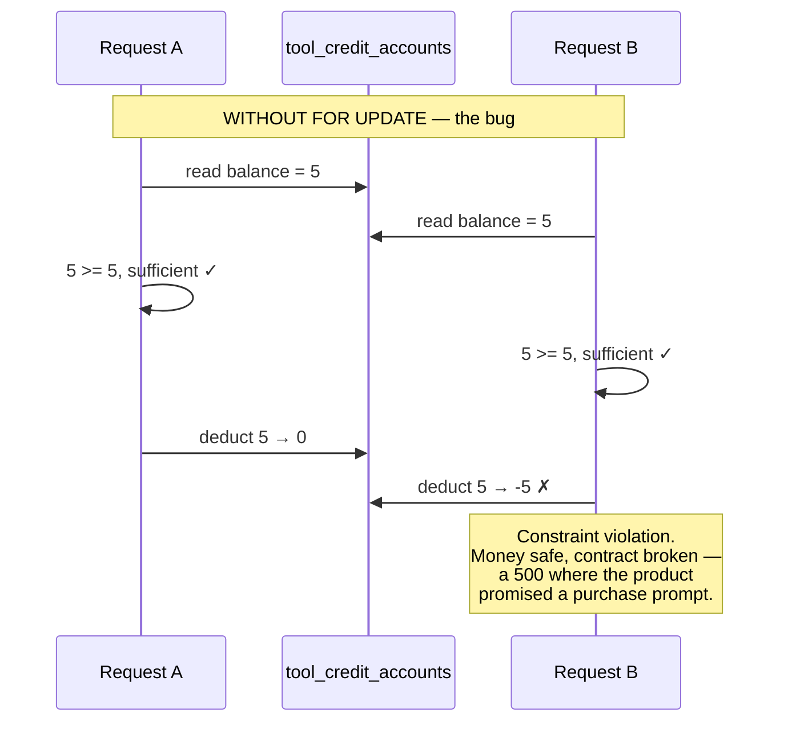
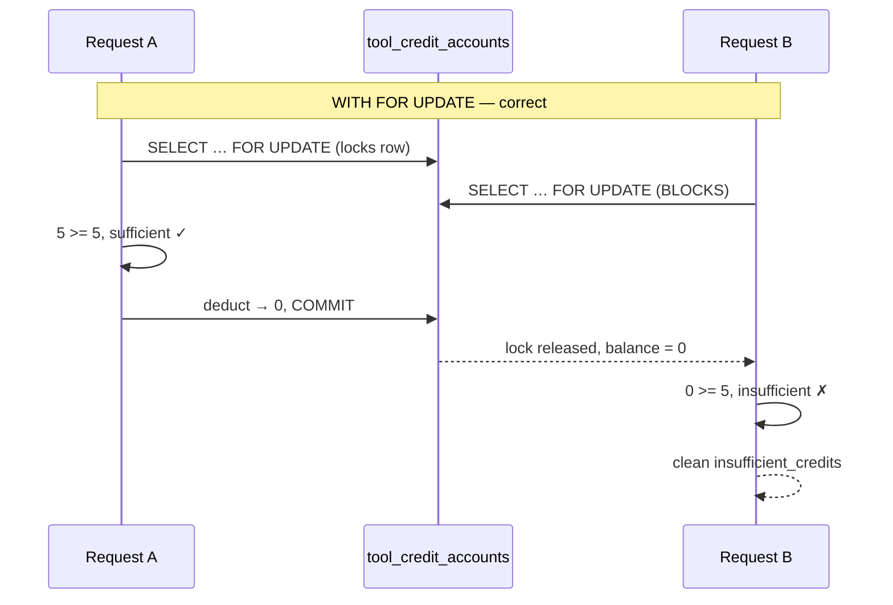
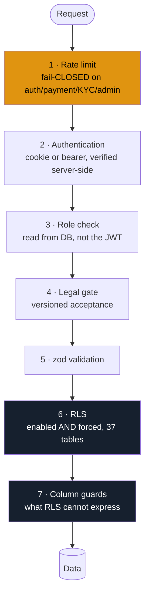

# Architecture & Flow Maps

The flows that are hard to reconstruct from source. Read [`../README.md`](../README.md) first for the framework and the quick start; this file is the layer beneath it.

---

## Contents

1. [The gate gauntlet](#1-the-gate-gauntlet) — how a customer reaches a professional
2. [Enquiry to payment](#2-enquiry-to-payment) — the money path
3. [Billing states](#3-billing-states) — subscriptions, grace, crossover
4. [The trust ladder](#4-the-trust-ladder) — verification
5. [Notification dispatch](#5-notification-dispatch)
6. [Credit spending](#6-credit-spending) — and why it needs a row lock
7. [Security layers](#7-security-layers)
8. [Scheduled jobs](#8-scheduled-jobs)

---

## 1. The gate gauntlet

The most commercially important flow on the platform. A customer wants a professional's contact details; the platform wants trust and, eventually, verification.

**Two free connections, then verification.** The design intent: browsing is free and frictionless, but someone contacting many professionals is either a serious customer or a nuisance, and verification separates them.

**An existing connection is always free.** Without that check the gate would charge a customer twice for one relationship — the customer would experience it as being punished for coming back.

**The counter is defended three ways** because it *is* the gate: maintained by trigger (never by application code), guarded at the column level (a customer cannot edit their own), and read server-side on every check (never trusted from the client).

Implemented in `requireCustomerConnectionGate` (`lib/access/api.ts`).

---

## 2. Enquiry to payment

**Why the public token pages matter.** Quotes and invoices are shared over WhatsApp to people who may have no account. The token page is the whole product for that person, so it must render on a phone, work signed-out, and be idempotent — someone will tap "Accept" twice.

**Why `job_logs` is append-only.** It is the record of what happened when a job is disputed. A mutable log is not evidence.

---

## 3. Billing states

### The crossover

Six **paid** months, not six calendar months — a Pioneer's clock starts when their first invoice is paid, not when they sign up. Two notices before the rate changes; a surprise increase is how a marketplace loses supply.

> The registered rate must remain strictly below the standard rate. If that ever inverts the entire incentive to register disappears — a unit test asserts it.

---

## 4. The trust ladder

**Every transition is an administrator's.** A professional cannot self-verify — the column guard raises `insufficient_privilege` on any attempt. That is not defensive coding: a self-verifiable badge is a badge that means nothing, and the badges are what customers are trusting.

Similarly, a professional cannot set `average_rating`, `review_count`, or move their own listing to `active`. The only self-service transition is `draft → pending_review`.

---

## 5. Notification dispatch

**`notification_flags` is checked first, on purpose.** It is a kill switch that works from a database row. A bug that mails every customer twice at 3am cannot be fixed by a deploy at 3am.

**Recipients are stored hashed.** Retry does not need the address, and storing it would turn the delivery log into a queryable index of every email and phone number on the platform — precisely the dataset a breach wants.

---

## 6. Credit spending

The clearest illustration of why concurrency safety matters here.

**The danger is not the arithmetic; it is the DECISION.** `FOR UPDATE` serialises the sufficiency check, not just the subtraction. Without it the balance CHECK still protects the money — but the caller gets a constraint violation instead of an answer.

This is proven by `commerce_policy.sql`, which opens a genuinely separate session via `dblink` and races it. **The test was verified to fail when `FOR UPDATE` is removed** — a concurrency test that cannot fail proves nothing.

The same pattern governs `claim_pioneer_place`: both caps are checked inside the row lock, or two simultaneous signups both see room and the category overfills.

---

## 7. Security layers

| Layer | Stops |
|---|---|
| Rate limit | Credential stuffing, card testing, scraping |
| Authentication | Anonymous access |
| Role | Wrong audience; a suspended account with a live token |
| Legal gate | Acting under superseded terms |
| zod | Malformed and hostile payloads |
| RLS | Reading or writing another user's rows |
| Column guards | Editing your **own** row's privileged columns |

**Why layer 7 exists.** RLS governs *which rows*, never *which columns*. The self-update policy on `profiles` is correct for `full_name` and catastrophic for `role` — without a column guard, a user could PATCH themselves to admin.

**Why the limiter fails closed.** V1's failed open, and on 19 July 2026 production was found logging `rate-limit:check_error` on *every* request: rate limiting had been silently off for an unknown period. The env vars were correct; the Redis instance was unreachable. Refusing a real user is recoverable; silently accepting unlimited credential-stuffing is not.

---

## 8. Scheduled jobs

```mermaid
gantt
    title Cron cadence
    dateFormat HH:mm
    axisFormat %H:%M

    section Every 5 min
    Notification drain      :00:00, 5m

    section Every 15 min
    Lifecycle scheduler     :00:00, 15m

    section Hourly
    Booking reminders       :00:00, 60m
    Job completion          :00:00, 60m

    section Daily
    Invoice reminders       :00:00, 30m
    Grace ladder            :01:00, 30m
    Pioneer sweep           :02:00, 30m
    Crossover sweep         :03:00, 30m
    Reconciliation          :04:00, 30m
```

Every job ends by upserting `cron_heartbeats`. `/api/health` reports a job stale when `now − last_ok_at > 1.5 × schedule`.

**`last_ok_at` is deliberately separate from `last_run_at`.** A job that runs and fails every time would look perfectly healthy if only the attempt were recorded.

All nine jobs are seeded, so one that has *never* run reads as "never succeeded" rather than being silently absent. V1 had no heartbeats at all — its crons were confirmed to be firing only by reading production logs by hand.

---

## Design notes worth carrying

**Idempotency is the recurring theme.** Webhooks redeliver, crons overlap, users double-tap, deploys restart mid-sweep. `stripe_events`, `billing_ladder_log`, the enquiry dedupe window, the scheduled-message unique index, and the token-page response record all exist for the same reason: **the second attempt must be a no-op, not a second charge.**

**Derived values are never client-writable.** Ratings, review counts, connection counts, and credit balances are all trigger-maintained and column-guarded. Each is a number some user has an incentive to change.

**Attribution degrades, records do not.** No `verified_by` / `resolved_by` / `moderated_by` column is required NOT NULL, because all are `ON DELETE SET NULL` — requiring them makes a departing administrator undeletable, which is also an erasure problem under data protection. The durable "who decided" lives in `admin_audit_log`, which is append-only and holds no foreign key to `profiles`.
